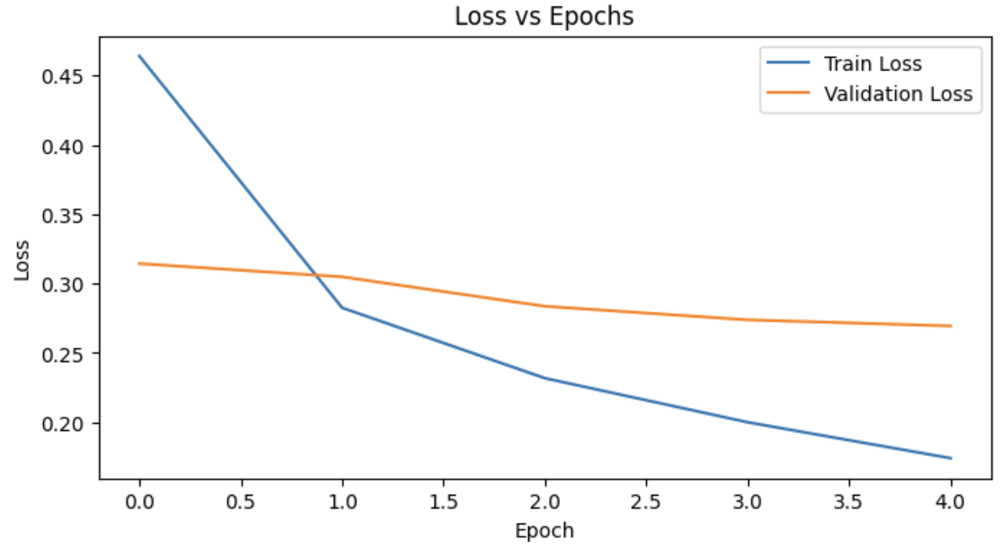
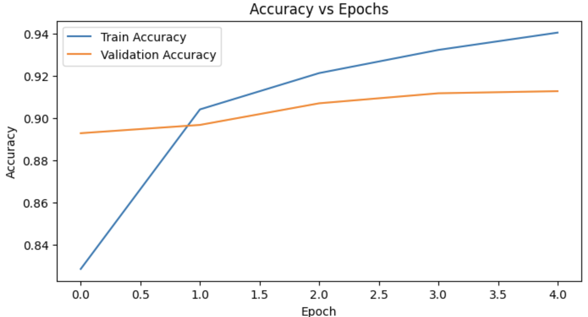
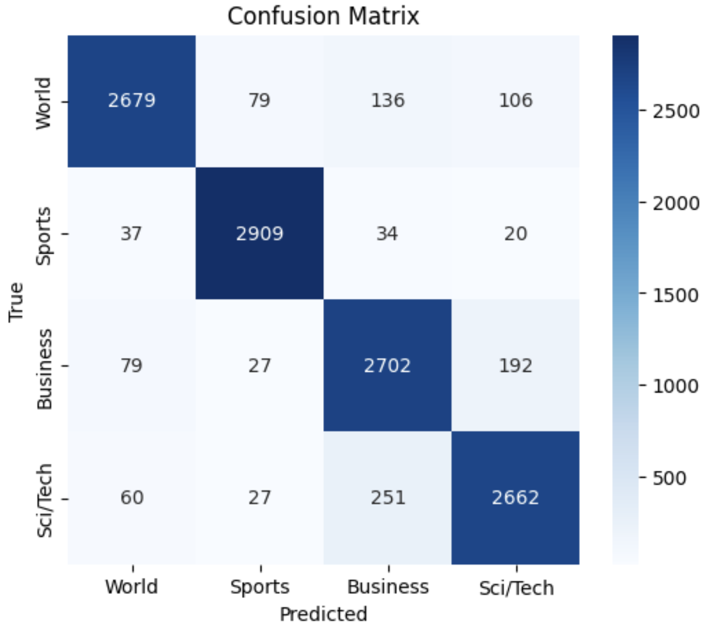
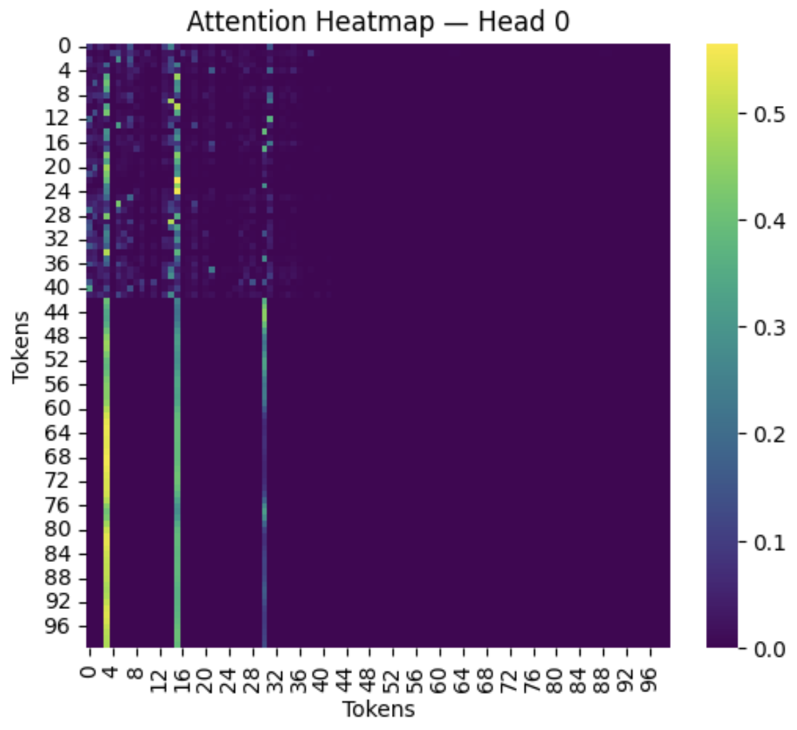

# Transformer Encoder From Scratch for Text Classification

This project implements a Transformer encoder architecture from first principles using PyTorch, without relying on high-level transformer libraries. The model is trained on the AG News dataset for multi-class topic classification.

The objective is to demonstrate a deep understanding of modern NLP architectures by manually implementing the core components of the Transformer and evaluating their performance empirically.

---

## Problem Statement

Transformers are the foundation of modern natural language processing systems such as BERT and GPT. However, many applications rely on pretrained models without understanding their internal mechanisms.

This project aims to implement a Transformer encoder architecture from scratch and apply it to text classification, enabling a deeper understanding of attention mechanisms, representation learning, and training dynamics.

---

## Dataset

**AG News Topic Classification Dataset**

- Source: HuggingFace Datasets
- Classes: World, Sports, Business, Sci/Tech
- Training samples: 120,000
- Test samples: 7,600
- Balanced across categories

AG News is a widely used benchmark for evaluating text classification models.

---

## Methodology

The model follows an encoder-only Transformer architecture consisting of:

1. Vocabulary-based tokenization
2. Word embeddings
3. Sinusoidal positional encoding
4. Multi-head self-attention
5. Position-wise feed-forward networks
6. Residual connections and layer normalization
7. Mean pooling for sequence representation
8. Linear classification head

---

## Model Architecture

```text
Input Text
  ↓
Tokenization → Token IDs
  ↓
Embedding Layer
  ↓
Positional Encoding
  ↓
Transformer Encoder Stack
  ↓
Mean Pooling
  ↓
Fully Connected Layer
  ↓
Softmax Classification

---


## Implementation Details

- Framework: PyTorch
- Embedding dimension: 128
- Number of attention heads: 4
- Encoder layers: 2
- Feed-forward dimension: 512
- Optimizer: Adam
- Loss function: CrossEntropyLoss
- Batch size: 64
- Training epochs: 5

---

## Results

The model demonstrates effective learning on the AG News dataset, achieving strong classification performance on the validation set.

Key observations:

- Stable convergence during training
- No severe overfitting observed
- Clear class separation in confusion matrix
- Reasonable generalization across topics

*(Replace with your exact metrics if desired.)*

---

## Visualizations

### Training and Validation Loss



---

### Accuracy Over Time



---

### Confusion Matrix



---

### Attention Heatmap




---

## Attention Analysis

Attention heatmaps reveal how the model distributes focus across tokens when making predictions.

Different attention heads capture distinct relationships between words, including:

- Topic-relevant terms
- Long-range dependencies
- Contextual associations

This provides interpretability into the model’s decision process.

---

## Limitations

- Model size is significantly smaller than modern pretrained Transformers
- Uses basic word-level tokenization instead of subword methods
- No large-scale pretraining on external corpora
- Limited depth due to hardware constraints

---

## Future Work

Potential improvements include:

- Implement subword tokenization (BPE or WordPiece)
- Increase model depth and width
- Add positional encoding variants
- Compare with pretrained models (e.g., BERT)
- Apply to additional NLP tasks such as sentiment analysis or question answering

---

## Reproducibility

To reproduce results:

1. Clone the repository
2. Install dependencies:
    pip install -r requirements.txt

3. Run preprocessing notebooks to generate datasets
4. Train the model using the training pipeline
5. Evaluate performance using the evaluation notebook

---

## Repository Structure

```text
transformer-from-scratch/
│
├── data/ # Processed datasets
├── models/ # Saved model weights
├── notebooks/ # Experiments and analysis
├── reports/ # Figures and visualizations
├── src/ # Model components
├── requirements.txt
└── README.md

